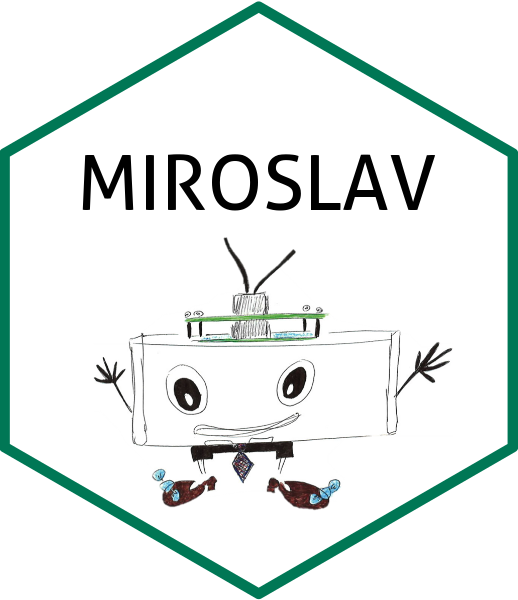

</img>
<br> MIROSLAV firmware <br>
[](https://doi.org/10.1101/2024.06.25.600592) [](https://doi.org/10.5281/zenodo.12191593) <br clear="left"/>
========

### What is it?

This repo holds everything needed to breathe life into a MIROSLAV device - MIROSLAVino Arduino firmware and Record-a-SLAV, a Python data acquisition script. MIROSLAV firmware was built to be used over a network, with the MQTT protocol, enabling scalable remote data acquisition from hundreds of cages. The MIROSLAV device is also equipped with environmental sensors.

Hardware designs can be found in the [`MIROSLAV-hardware` repository](https://github.com/davorvr/MIROSLAV-hardware). A complete, user-friendly MIROSLAV software toolkit for analysis of MIROSLAV data, from raw data to statistical analysis, can be found in the [`MIROSLAV-analysis` repository](https://github.com/davorvr/MIROSLAV-analysis) - also contains an example dataset of real data recorded in our lab.

### What is MIROSLAV, anyway?

**MIROSLAV (_Multicage InfraRed Open Source Locomotor Activity eValuator_)** is a platform for non-invasive monitoring of circadian locomotor activity in laboratory rodents. MIROSLAV is fully open source and scalable to hundreds of cages. All of its hardware and software components are described in the paper: https://doi.org/10.1101/2024.06.25.600592

***

### How do I set it up?

To make full use of MIROSLAV's potential, you need a Wi-Fi network (which does **not** need to be connected to the Internet) and a computer.

1. To set up a Wi-Fi network, you can use any Wi-Fi router - just power it up and connect your computer to it.

2. It is advisable to set up a static IP address for your computer to ensure it won't change - if it does, MIROSLAV's configuration needs to be updated as well.

3. Set up an MQTT broker on your computer.

    * [Mosquitto](https://mosquitto.org/download/) is one of the most widely used brokers. Once installed, these two configuration options need to be added to `mosquitto.conf`:

    ```
    allow_anonymous true
    listener 1883 0.0.0.0
    ```

    Password authentication is also available and MIROSLAV supports it, but it's a bit more work to set up.

    * **On Windows**: By default, the config file's location is `C:\Program Files\mosquitto\mosquitto.conf`. Briefly, after you add the configuration changes and reboot, you should have it up and running automatically. You can also not reboot, and instead open up *Services* (a Windows built-in tool), scroll down to `Mosquitto`, right-click and select `Start`. The broker IP address in `config.h` is then the IP address of your computer. You can find your IP address by opening up *Command Prompt* and typing `ipconfig`.
      
    * If you don't want it to autostart every time you boot, in *Services*, right-click on `Mosquitto`, select `Properties`, and under `Startup type` select `Manual`. This way, it will only start if you manually start it from `Services`.
      
    * **On Linux**, it's usually as easy as installing Mosquitto using your package manager (on Ubuntu, and likely many other distros, the package is called `mosquitto`), setting up the config (the config file's location is `/etc/mosquitto/mosquitto.conf` by default) and running `sudo systemctl start mosquitto.service` (replace `start` with `stop` to terminate the broker). If you want it to start on boot, run `sudo systemctl enable mosquitto.service`, and to disable autostart on boot, replace `enable` with `disable` in the previous command. You can check your computer's IP address by opening up a terminal window and running `ip addr`.

5. Set up your network options and other MIROSLAV device parameters `config.h` and upload MIROSLAVino to your MIROSLAV device.

6. Start Record-a-SLAV. If you do not have Python and use Windows, we prefer [WinPython](https://winpython.github.io/) to get an easy-to-setup Python distribution. Be sure to install the `paho-mqtt` library using `pip`.

### Wireless code and config upload

Additionally, once you power up your MIROSLAV, you can access it via its IP specified in `config.h` and upload code with a changed configuration remotely:

1. In the Arduino IDE, click `Sketch > Export Compiled Binary`.
2. In the MIROSLAVino directory which holds the `miroslavino.ino` program, a `build` directory will appear. Inside it should be one directory, `esp32.esp32.esp32s2`, with multiple files - we will need `miroslavino.ino.bin`.
4. In the address bar of your web browser, type in MIROSLAV's IP address as specified in `config.h`.
5. In the interface, navigate to `miroslavino.ino.bin`, select it, and upload it.
 
After a few minutes, your MIROSLAV should be running the updated code.

### Dependencies

#### Arduino (MIROSLAVino)

##### Board definitions

* [Arduino core for the ESP32-S2](https://github.com/espressif/arduino-esp32) - Briefly, in Arduino IDE settings, add the additional boards manager URL `https://espressif.github.io/arduino-esp32/package_esp32_index.json`, install `esp32` by Espressif Systems in the boards manager and select `ESP32S2 Dev Module` in the boards menu. (tested with v3.0.1)

##### Libraries

[How to install Arduino library?](https://wiki.seeedstudio.com/How_to_install_Arduino_Library/)

* [`AsyncMqttClient` by marvinroger](https://github.com/marvinroger/async-mqtt-client) (tested with v0.9.0)
* [`BH1750FVI_RT` by RobTillaart](https://github.com/RobTillaart/BH1750FVI_RT) (tested with v0.3.1)

#### Python (Record-a-SLAV)

* `paho-mqtt`

### To do

* We should improve the setup instructions and code documentation - contributions (via the e-mail listed in the MIROSLAV paper or via a pull request) are welcome.

* Password authentication setup instructions for Mosquitto.

* Done (v0.5) - <span style="color:gray">~~_MIROSLAV device has two onboard sensor modules: HDC1080 (temperature, humidity) and BH1750 (illumination). We are currently working on implementing their functionality in the code. The functionality for an additional PIR (attached to the onboard ENVPIR connector) to monitor human entries into the habitat room is implemented._~~</span> 

* Done (v0.5) - <span style="color:gray">~~_Make it easier to use an arbitrary number of input serialisation boards on the stack._~~</span>

### Related repositories

* [`MIROSLAV-hardware`](https://github.com/davorvr/MIROSLAV-hardware) - Everything you need to construct the MIROSLAV device and start monitoring hundreds of rodents' locomotor activity patterns 24/7 in their home cages.
* [`mirofile`](https://github.com/davorvr/mirofile) - Your buddy for dealing with raw MIROSLAV data. A Python library used by Prepare-a-SLAV to parse raw MIROSLAV logs into a dataframe.
* [`MIROSLAV-analysis`](https://github.com/davorvr/MIROSLAV-analysis) - A complete, user-friendly MIROSLAV software toolkit for analysis of MIROSLAV data, from raw data to statistical analysis. Also contains an example dataset with real data recorded in our lab.

### License

You can modify any part of MIROSLAV freely under the **GPLv3** license - if you have any questions, problems, or ideas on how to improve MIROSLAV, feel free to reach out to us, submit a GitHub issue, or a pull request.

The MIROSLAV logo is created by Petra Šoštarić Mužić and licensed under the **CC BY-NC-SA 4.0** license - more details can be found in the repository's [`logo/` directory](logo/).
